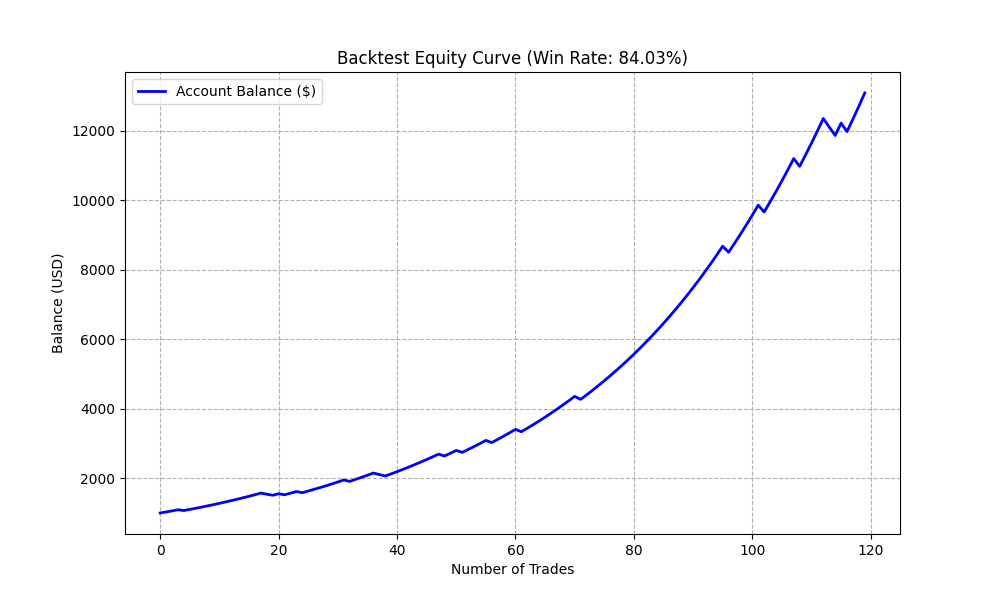

# Bitcoin FVG Algorithmic Trading System
##  Project Overview (專案簡介)
本專案是一個針對加密貨幣市場開發的自動化交易系統。透過 Python 連接 Binance API 獲取即時與歷史數據，並運用Fair Value Gap (FVG)演算法識別市場供需失衡區間，進行策略回測與即時訊號監控。

##  Tech Stack (使用技術)
* **Language:** Python 3.11
* **Data Analysis:** Pandas
* **Network/API:** Aiohttp (AsyncIO 非同步架構), Python-Telegram-Bot
* **Visualization:** Matplotlib

##  Key Features (核心功能)
1.  **Market Monitoring:** 透過 Telegram Bot 實現即時報價與趨勢監控。
2.  **FVG Algorithm:** 自動識別看漲/看跌缺口，並結合 EMA 趨勢濾網。
3.  **Backtesting Engine:** 模擬歷史 K 線數據，包含動態部位管理 (Position Sizing) 與風險計算。

##  Backtest Performance (回測成果)
* **Win Rate:** 84.03% (於多頭趨勢區間驗證)
* **Equity Curve (資金曲線):**

##
本作品適用於學習程式語言使用，並未包含滑價、手續費、kick級別的數據，因此不能當作投資工具使用，僅供學習！！
